# 🧠⚡ NexaPact Protocol: Decentralized Agent Labor & Multi-Milestone Escrow on GenLayer

[](https://opensource.org/licenses/MIT)
[](https://docs.genlayer.com)
[](https://github.com/genlayerlabs)
[-00f5a0.svg)](#-test-suite--verification)
[](https://portal.genlayer.foundation/agent-tank/hackathon)
[](https://explorer-studio-dev.genlayer.com)

**NexaPact Protocol** is the decentralized labor, reputation, and progressive escrow layer for the emerging autonomous agent economy. Built natively on **GenLayer Intelligent Contracts**, NexaPact enables trustless milestone-based agreements between autonomous AI agents and human specialists where **deliverable completion is adjudicated via multi-validator neural consensus grounded on live web evidence** (GitHub PRs, test suites, and live API endpoints).

---

## 💡 The Core Problem: The Contested Moment in Agentic Commerce

In the autonomous agent economy (ERC-8004, Agent-to-Agent micropayments), AI agents must contract, hire, and settle with other agents at machine speed. However:

1. **Deterministic Smart Contracts Cannot Evaluate Deliverables**: EVM contracts can only verify on-chain balances. They cannot read GitHub, verify unit test coverage, or determine whether code satisfies complex acceptance criteria.
2. **Centralized Oracles & Human Courts Are Too Slow**: Human arbitration takes weeks and costs hundreds of dollars, completely incompatible with sub-minute agent commerce.
3. **The Contested Point**: *"Did the worker agent fulfill the contract specifications, or is the deliverable defective?"*

### ⚡ The NexaPact Solution on GenLayer
NexaPact replaces subjective human arbitration with **decentralized, multi-validator neural consensus under GenLayer's Equivalence Principle**:

* **Live Web Evidence (`gl.nondet.web.get`)**: Validators independently fetch live pull requests, build artifacts, test logs, or API responses directly from the web.
* **Multi-Axis Neural Evaluation (`gl.nondet.exec_prompt`)**: Validators evaluate deliverables across four orthogonal dimensions (Functional Completeness, Acceptance Criteria Compliance, Code Quality, and Defect Severity).
* **Equivalence Principle Consensus (`gl.vm.run_nondet_unsafe`)**: Consensus is reached when independent validators agree within strict bound tolerances (±8 points, strict categorical defect tier agreement).
* **Deterministic Fund Release & Reputation Engine**: Passing milestones immediately release locked GEN tokens to the contractor and boost their on-chain reputation score (+15 points); defective submissions trigger `REVISION_REQUIRED` with reputation decay.

---

## 🏛️ System Architecture

```mermaid
sequenceDiagram
    autonumber
    actor Client as 🤖 Client / Hiring Agent
    participant Pact as 🧠 NexaPact (GenVM Contract)
    actor Worker as 🛠️ Worker / Contractor Agent
    participant Validators as ⚖️ GenLayer Validators (Optimistic Democracy)
    participant Web as 🌐 Live Web (GitHub PR / CI Logs / API)

    Client->>Pact: create_agreement(contractor, title) + deposit GEN
    Client->>Pact: add_milestone(spec, evidence_url, payout)
    Worker->>Pact: submit_and_adjudicate_milestone(agreement_id, milestone_idx, notes)
    
    rect rgb(15, 23, 42)
        Note over Pact,Validators: Non-Deterministic Multi-Validator Consensus
        Validators->>Web: gl.nondet.web.get(evidence_url)
        Validators->>Validators: gl.nondet.exec_prompt(Multi-Axis Scoring)
        Validators->>Validators: Equivalence Principle Check (±8 pt tolerance across 4 axes)
    end

    alt Consensus Passing (Scores >= 70 & Defect != HIGH/CRITICAL)
        Pact->>Worker: emit_transfer(payout_amount) [APPROVED]
        Pact->>Pact: contractor.reputation += 15, completed_tasks += 1
    else Defective / Criteria Incomplete
        Pact-->>Worker: status = REVISION_REQUIRED
        Pact->>Pact: contractor.reputation -= 5
    end

    opt Failure to Deliver / Incomplete Project
        Client->>Pact: refund_remaining(agreement_id) -> Return unused GEN
    end
```



---

## 🔬 Multi-Axis Adjudication Matrix

Unlike simplistic binary escrow contracts, NexaPact enforces multidimensional scrutiny:

| Axis | Range | Passing Threshold | Description |
| :--- | :---: | :---: | :--- |
| **Functional Completeness** | `0 - 100` | $\ge 70$ | Did the deliverable achieve the stated core objective? |
| **Criteria Compliance** | `0 - 100` | $\ge 70$ | Were all explicit bullet points in the specification fulfilled? |
| **Code & Output Quality** | `0 - 100` | $\ge 70$ | Readability, test coverage, documentation, and architecture cleaniness. |
| **Defect Severity** | `Categorical` | `NONE` / `LOW` / `MEDIUM` | `HIGH` or `CRITICAL` defects trigger mandatory `REVISION_REQUIRED`. |

### Equivalence Principle Guarantees:
1. **Categorical Defect Agreement**: The leader validator and independent checking validators must agree on whether the deliverable contains critical flaws.
2. **Numeric Tolerance Bound**: For all quantitative axes, validator scores must match the leader within **`±8 points`**.

---

## 📁 Repository Structure

```tree
nexapact/
├── contracts/
│   └── nexapact.py               # GenLayer Intelligent Contract (GenVM Python)
├── frontend/
│   ├── client.ts                 # TypeScript SDK bindings using genlayer-js
│   └── index.html                # Interactive glassmorphism Web3 dApp
├── tests/
│   └── direct/
│       ├── conftest.py           # In-memory GenVM test harness & mocks
│       └── test_nexapact.py      # Comprehensive 5/5 unit test suite
├── gltest.config.yaml            # GenLayer Studio / testnet configuration
├── package.json                  # Node.js dependencies & scripts
├── requirements.txt              # Python test dependencies
├── pytest.ini                    # Pytest configuration
└── README.md                     # Technical documentation & architecture
```

---

## 🧪 Test Suite & Verification

NexaPact includes a complete, independent unit test suite verifying:
- ✅ Agreement creation and locked escrow deposits
- ✅ Milestone addition with deposit overflow protection
- ✅ Successful deliverable adjudication and automatic fund release
- ✅ Defective work detection with `REVISION_REQUIRED` state
- ✅ Unauthorized access prevention (strict role isolation)
- ✅ Unclaimed funds refund mechanics

### Running the Tests:
```bash
# 1. Install dependencies
pip install -r requirements.txt

# 2. Run the direct GenVM test suite
pytest tests/direct -v
```

Expected Output:
```text
============================= test session starts =============================
collected 8 items

tests/direct/test_nexapact.py::test_agreement_lifecycle_and_adjudication PASSED
tests/direct/test_nexapact.py::test_milestone_rejection_on_defective_work PASSED
tests/direct/test_nexapact.py::test_refund_unclaimed_funds PASSED
tests/direct/test_nexapact.py::test_unauthorized_access_reverts PASSED
tests/direct/test_nexapact.py::test_milestone_allocation_overflow_reverts PASSED
tests/direct/test_nexapact.py::test_validator_equivalence_consensus_within_tolerance PASSED
tests/direct/test_nexapact.py::test_validator_equivalence_failure_on_score_divergence PASSED
tests/direct/test_nexapact.py::test_validator_equivalence_failure_on_defect_severity_mismatch PASSED

============================== 8 passed in 0.05s ==============================
```

---

## 🌐 Interactive Web3 Frontend & Client SDK

A drop-in, zero-dependency glassmorphism dashboard is included in `index.html` (and `frontend/index.html`). It provides:
- **Agreement Creator**: Lock GEN deposits and configure milestone specifications.
- **Evidence Inspector**: Submit GitHub PR URLs and view multi-validator Equivalence Principle consensus.
- **Agent Reputation Profile**: Track completed tasks and on-chain trust scores.
- **Direct RPC Integration**: Pre-configured for **GenLayer Studio Next (Chain ID: 61997)** by default, with support for Studionet (61999) and Bradbury Testnet (4221).
- **Deployed Intelligent Contract Address**: `0xaC164931237F788A86Fad7712D5c900e00CF032A` (pre-filled on Studio Next).

To run the local frontend:
```bash
npx serve frontend
```

---

## 📜 Intelligent Contract Interface (`contracts/nexapact.py`)

### Public Write Methods:
* `create_agreement(contractor: str, title: str) -> u256` *(payable)*
* `add_milestone(agreement_id: u256, description: str, evidence_url: str, payout_amount: u256) -> u32`
* `submit_and_adjudicate_milestone(agreement_id: u256, milestone_idx: u32, submission_notes: str) -> str`
* `refund_remaining(agreement_id: u256) -> u256`

### Public View Methods:
* `get_agreement(agreement_id: u256) -> dict`
* `get_milestone(agreement_id: u256, milestone_idx: u32) -> dict`
* `get_agent_profile(agent_address: str) -> dict`

---

## 🏆 GenLayer Agent Tank Hackathon Submission

* **Participant:** `Leknax` ([Profile](https://portal.genlayer.foundation/participant/59834))
* **Track:** `Agentic Commerce Infrastructure`
* **Sub-Tags:** `SLA & Uptime Verification`, `Buyer-Seller Matching`
* **GitHub:** [https://github.com/Lesnak1/nexapact](https://github.com/Lesnak1/nexapact)
* **License:** MIT
